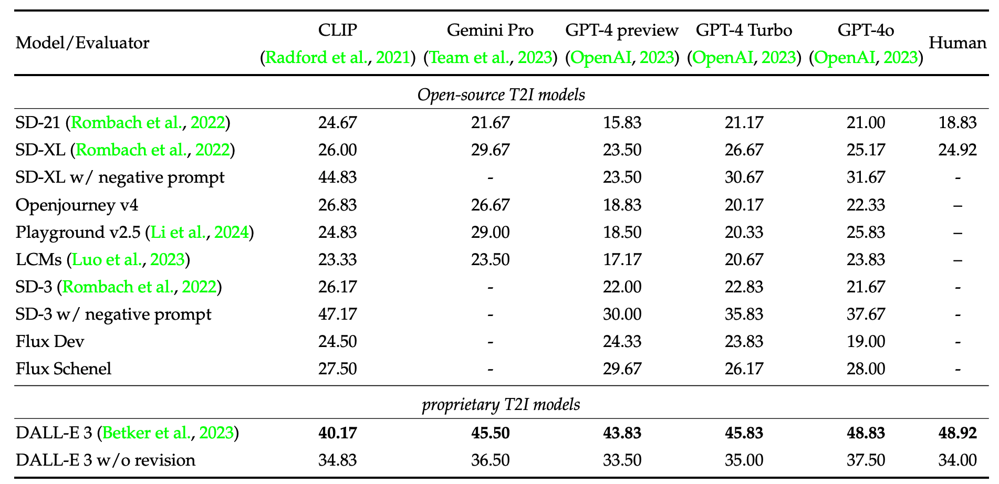

#  Commonsense-T2I Challenge: Can Text-to-Image Generation Models Understand Commonsense?
This repo contains code for the paper "[Commonsense-T2I Challenge: Can Text-to-Image Generation Models Understand Commonsense?](https://zeyofu.github.io/CommonsenseT2I/)" **[COLM 2024]**

[**🌐 Homepage**](https://zeyofu.github.io/CommonsenseT2I/) | [**🤗 Dataset**](https://huggingface.co/datasets/CommonsenseT2I/CommonsensenT2I) | [**📑 Paper**](https://arxiv.org/pdf/2406.07546) | [**💻 Code**](https://github.com/zeyofu/Commonsense-T2I) | [**📖 arXiv**](https://arxiv.org/pdf/2406.07546) | [**𝕏 Twitter**](https://twitter.com/XingyuFu2/status/1801369092944969736)

## 🔔News

 **🔥[2024-08-12]: Codes and output visualizations are released!**
 
 **🔥[2024-08-05]: Added Stable Diffusion 3 and Flux models for comparison.**
 
 **🔥[2024-07-10]: Commonsense-T2I is accepted to [COLM 2024](https://colmweb.org/index.html) with review scores of 8/8/7/7 🎉**

 **🔥[2024-06-13]: Released [the website](https://zeyofu.github.io/CommonsenseT2I/).**

## Introduction
We present <b>a novel task and benchmark </b>for evaluating the ability of text-to-image(T2I) generation models to produce images that fit commonsense in real life, which we call <b>Commonsense-T2I</b>.
    Commonsense-T2I presents an <b>adversarial challenge</b>, providing pairwise text prompts along with expected outputs. <br>

<ul>
    <li>Given <b>two adversarial</b> text prompts containing an identical set of action words with minor differences, such as <b>"<i>a lightbulb without electricity</i>"</b> v.s. <b>"<i>a lightbulb with electricity</i>"</b>, we evaluate whether T2I models can conduct visual-commonsense reasoning, eg. produce images that fit <b>"<i>The lightbulb is unlit</i>"</b> v.s. <b>"<i>The lightbulb is lit</i>"</b> correspondingly.
    </li> <br>
    <li>The dataset is carefully <b>hand-curated by experts</b> and annotated with fine-grained labels, such as commonsense type and likelihood of the expected outputs, to assist analyzing model behavior. We benchmark a variety of state-of-the-art (sota) T2I models and surprisingly find that, there is still a large gap between image synthesis and real life photos--even the <b>DALL-E 3 model</b> could only achieve <b>48.92%</b> on <b>Commonsense-T2I</b>, and the <b>Stable Diffusion XL model</b> only achieves <b>24.92%</b> accuracy.</li> <br>
    <li>Our experiments show that GPT-enriched prompts <b>cannot</b> solve this challenge, and we include a detailed analysis about possible reasons for such deficiency.</li>
</ul>

## Load Dataset
```
import datasets

dataset_name = 'CommonsenseT2I/CommonsensenT2I'
data = load_dataset(dataset_name)['train']
```

## Usage
```
# We include image generation codes that use huggingface checkpoints
python generate_images.py

# Evaluate the generated images and calculate an overall score
python evaluate.py

# To better see the generated images, visualize the outputs
python visualize.py
```

An example output is provided in ```example_visualization_dalle.html```, check it out using a web browser.

## Saved outputs
[Output visualizations](https://zeyofu.github.io/CommonsenseT2I/) can be found for the text-to-image models tested in our paper, e.g. [DALL-E 3 outputs](https://zeyofu.github.io/CommonsenseT2I/visualization_dalle3.html), [Stable Diffusion 3 outputs](https://zeyofu.github.io/CommonsenseT2I/visualization_sd_3neg.html), and [Flux model outputs](https://zeyofu.github.io/CommonsenseT2I/visualization_flux_schenel.html). For more details, check out our paper! 



## Contact
- Xingyu Fu: xingyuf2@seas.upenn.edu

## Citation

**BibTeX:**
```bibtex
@article{fu2024commonsenseT2I,
    title = {Commonsense-T2I Challenge: Can Text-to-Image Generation Models Understand Commonsense?},
    author = {Xingyu Fu and Muyu He and Yujie Lu and William Yang Wang and Dan Roth},
    journal={arXiv preprint arXiv:2406.07546},
    year = {2024},
}
```
